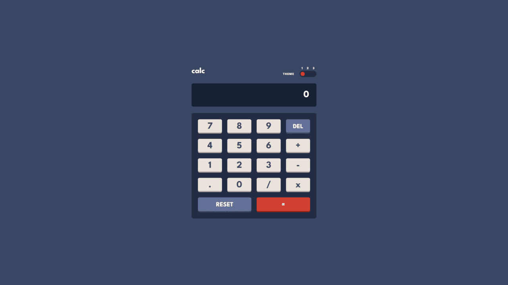

# Frontend Mentor - Calculator app solution

This is a solution to the [Calculator app challenge on Frontend Mentor](https://www.frontendmentor.io/challenges/calculator-app-9lteq5N29). Frontend Mentor challenges help you improve your coding skills by building realistic projects. 

## Table of contents

- [Overview](#overview)
  - [The challenge](#the-challenge)
  - [Screenshot](#screenshot)
  - [Links](#links)
- [My process](#my-process)
  - [Built with](#built-with)
  - [What I learned](#what-i-learned)
  - [Useful Resources](#useful-resources)
- [Author](#author)

## Overview

### The challenge

Users should be able to:

- See the size of the elements adjust based on their device's screen size
- Perform mathmatical operations like addition, subtraction, multiplication, and division
- Adjust the color theme based on their preference
- **Bonus**: Have their initial theme preference checked using `prefers-color-scheme` and have any additional changes saved in the browser

### Screenshot



### Links

- Solution URL: [Solution](https://www.frontendmentor.io/solutions/calculator-app-reactjs-and-tailwindcss-wgt1UmqECK)
- Live Site URL: [Website](https://calculator-app-ninhos0s-projects.vercel.app/)

## My process

### Built with

- Semantic HTML5 markup
- CSS custom properties
- Flexbox
- CSS Grid
- Mobile-first workflow
- [React](https://reactjs.org/) - JS library
- [Tailwind CSS](https://tailwindcss.com/) - For styles

### What I learned

I first discovered and used [tw-colors](https://www.npmjs.com/package/tw-colors), a plugin for tailwindcss that helps you add additional themes.

```js
import { createThemes } from 'tw-colors';

/** @type {import('tailwindcss').Config} */
export default {
  plugins: [createThemes({
    dark: {...},
    light: {...},
    night: {...}
  })]
};
```

### Useful resources

- [tw-colors](https://www.npmjs.com/package/tw-colors) - A plugin for tailwindcss helped me add additional themes to the project (light, dark and night)

## Author

- [Website](https://portifoliov2-client.vercel.app/)
- [Frontend Mentor](https://www.frontendmentor.io/profile/NINHOS0)
- [Linkedin](https://www.linkedin.com/in/renan-polido-805a66248/)
- [Github](https://github.com/NINHOS0)
